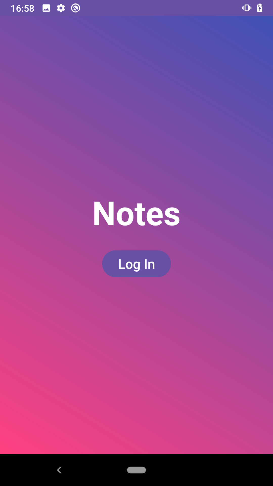
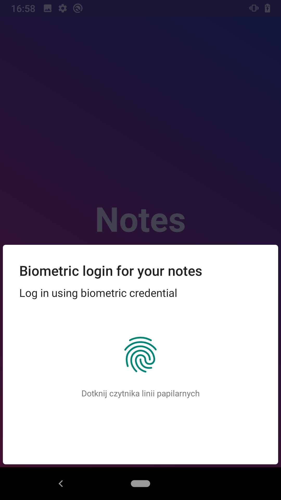
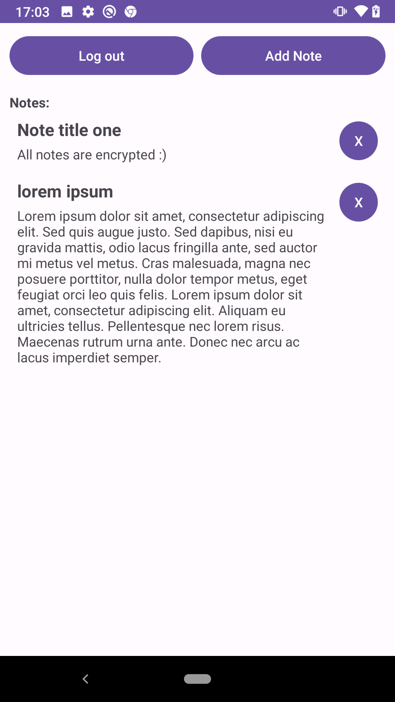
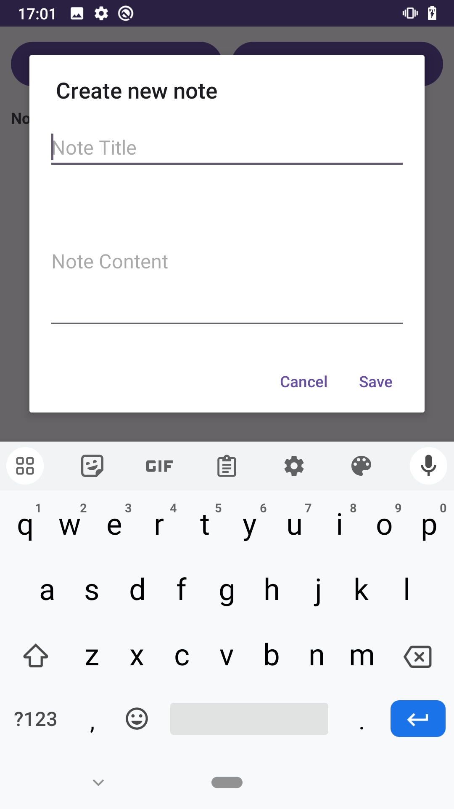
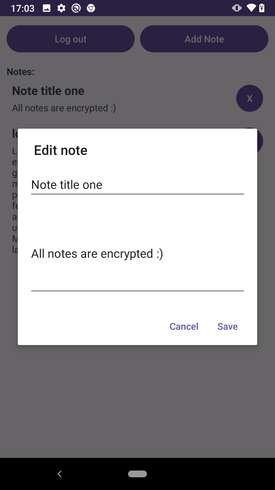

# secure-notepad-fingerprint-login

Aplikacja to notatnik do którego dostęp zabezpieczony jest odciskiem palca. Przeznacozna dla 1 użytkownika. 

## Wykorzystane mechanizmy bezpieczeństwa

1. Notatki są zaszyfrowane algorytmem AES-256 w trybie CBC.
2. Padding 
3. Wektor początkowy generowany jest losowo przez SecureRandom. 
4. Klucz jest przechowywany w Android Key Store - hardwearowo zabezpieczonym miejscu. 
5. Ochrona przed rootowaniem dzięki ustawieniu setUserAuthenticationRequired(true)

## Zrzuty ekranu z działania aplikacji

